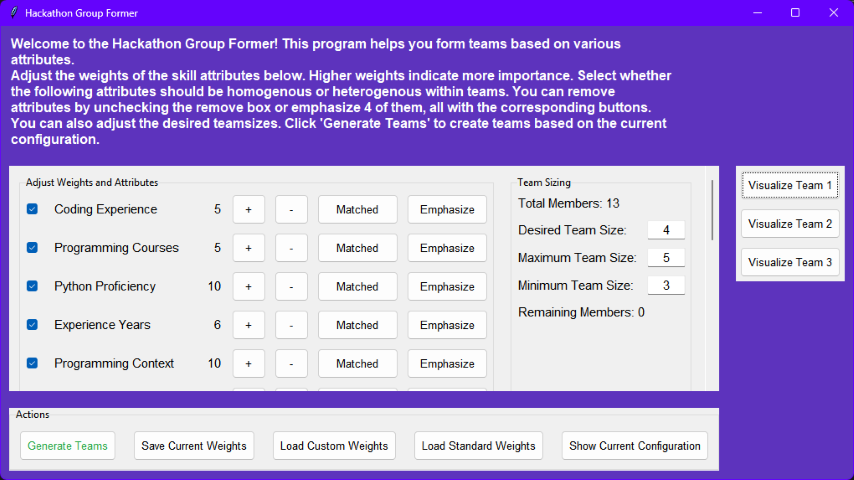
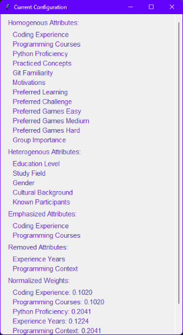

# **Group Former**

Group Former, a Python-based application designed to help form teams for hackathon like events based on various attributes such as programming skills, motivations, project preferences, familiarity, and demographic/background.

The application uses a graphical user interface (GUI) built with Tkinter and provides functionalities for loading survey data from the results of the pre-event-survey, adjusting weights for different attributes, and generating teams based on the configured settings.

The application can be run locally or through a Docker container for an isolated and portable environment.

In the surveys folder you can find the pre-event-survey that is used to gather the data needed to form teams.

## Table of Contents

- [Visuals](#visuals)
- [Usage](#usage)
- [Dependencies](#libraries-and-dependencies)
- [Installation](#installation)
- [Folder Structure](#folder-structure)
- [Files](#files)
- [Questionnaire](#questionnaire)

## Visuals

1. After selecting a csv file with the survey results the main window opens.
    

2. When the teams are formed to your liking the visualization is ready to be openend from the main window.
    

3.
    

## Usage

1. When you run the application, a file dialog will prompt you to select a CSV file containing the survey data.
2. The main window will display various attributes and their weights. You can adjust the weights using the "+" and "-" buttons.
3. Toggle attributes between homogenous (matching) and heterogenous (diverse) using the "Matched" and "Diverse" buttons.
4. Emphasize specific attributes using the "Emphasize" button.
5. Adjust the desired team size, maximum team size, and minimum team size.
6. Click "Generate Teams" to form teams based on the current configuration. If the teamsizes are invalid they will get adjusted.
7. Visualize the generated teams by clicking the appearing "Visualize Team" buttons.
8. Save the current weights to a CSV file or load custom/standard weights CSV file using the respective buttons.
9. Load in a different survey file with the corresponding button if needed.
10. View the current configuration by clicking the "Show Current Configuration" button.

## Libraries and Dependencies

**Prerequisite**: [Python 3](https://www.python.org/) Version: 3.13

**Standard Libraries**:

- [sys](https://docs.python.org/3/library/sys.html)
- [os](https://docs.python.org/3/library/os.html)
- [re](https://docs.python.org/3/library/re.html)
- [json](https://docs.python.org/3/library/json.html)
- [itertools](https://docs.python.org/3/library/itertools.html)
- [Tkinter](https://docs.python.org/3/library/tkinter.html)

**External Libraries** Installed via the `requirements.txt`:

- [NetworkX](https://networkx.org/) Version: 3.3
- [Matplotlib](https://matplotlib.org/) Version: 3.8.4
- [pandas](https://pandas.pydata.org/) Version: 2.2.2

## Installation

### Using Github

1. **Clone the Repository**: Open your terminal and clone the repository using https and git with the following command in the directory u want:

    ```bash

    git clone https://github.com/Timotheus21/group_former.git

    ```

2. **Navigate to the Project Directory**: For example change your current directory inside your terminal to the cloned repository. Change the example path with your actual path.

    ```bash

    cd C:\example\path\group_former

    ```

3. **Create a Virtual Environment** (optional but recommended): Create and activate a virtual environment to manage dependencies:

    ```bash
    python -m venv env  # On Mac simply use python3 instead
    env\Scripts\activate  # On Mac use `source env/bin/activate`
    ```

4. **Install Dependencies**: Install the required dependencies using pip:

    ```bash

    python -m pip install -r requirements.txt

    ```

5. **Run the Application**: Run the application for example via the `main.py` file if your in the project directory.

    ```bash

    python main.py

    ```

### Using Docker

1. **Install Docker**: Ensure Docker is installed on your system. Follow the official [Docker Installation Guide](https://docs.docker.com/get-docker/) for your operating system.

2. **Install an X Server**: Since the application uses a GUI, you need an X server running in the background. Install and start an X server, such as [Xming](https://sourceforge.net/projects/xming/) on Windows or [XQuartz](https://www.xquartz.org/) on macOS. For Linux users, an X server is typically already installed.

3. **Allow Docker to Use Your Display**: Configure your X server to allow Docker to display the GUI:
   - On Linux: Run the following command in your terminal:

     ```bash
     xhost +local:docker
     ```

   - On Windows/macOS: Ensure your X server allows incoming connections. Check the specific settings of your X server.

4. **Place the Survey Files in the Directory**: Since the application runs in a container and requires you to select the survey file during runtime, you need to place the survey files you want to use inside the directory where the container can access them. For example, place them in a folder you will mount into the container, such as `/path/to/surveys`.

5. **Pull the Docker Image**: Download the Docker image from Docker Hub. Run the following command in your terminal:

   ```bash

   docker pull timotheusbal/group_former

   ```

6. **Run the Application**: Start the Docker container and pass the necessary display information, mounting the directory containing the survey files to ensure the application can access them. Replace /path/to/surveys with the path to your survey files and host.docker.internal:0.0 with the appropriate value for your operating system:
    - Windows/macOS:

   ```bash

   docker run -it --rm -e DISPLAY=host.docker.internal:0.0 -v /tmp/.X11-unix:/tmp/.X11-unix -v /path/to/surveys:/app/surveys timotheusbal/group_former

   ```

    - Linux

   ```bash

   docker run -it --rm -e DISPLAY=$DISPLAY -v /tmp/.X11-unix:/tmp/.X11-unix timotheusbal/group_former

   ```

7. **Test the Application**: The application should now run, display the GUI through your X server, and allow you to select the survey files from the mounted directory.

### Troubleshooting Docker

- Error: Cannot connect to X server: Ensure your X server is running and properly configured to accept connections.
- Display Not Working: Verify the DISPLAY environment variable is correctly set for your system.
- X Server for macOS/Windows: Confirm that host.docker.internal:0.0 is the correct display address. If unsure, check your X server documentation.
- Survey Files Not Found: Ensure the survey files are placed in the directory you specified and that the directory is correctly mounted to the container. Alternatively place them directly inside the folder.

## Folder structure

```filenames

┌── hackathon-group-former/
│ ┌─ screen_shots/                      # Images for README documentation
│ │ ┌── config.png
│ │ ├── mainwindow.png
│ │ └── visualize.png
│ ├── storage/                          # Storage for processed data and configuration files
│ │ ┌── custom_weights.csv              # will be created on startup when not existing
│ │ ├── interpreter.json
│ │ ├── questionnaire_example.csv
│ │ ├── std_weights.csv                 # will be created on startup when not existing
│ │ └── transformed_results_survey.csv  # will be created on startup when not existing
│ ├── surveys/                          # Pre-event survey templates
│ │ ┌── Pre Event Survey.lss
│ │ └── Pre Event Survey.txt
│ ├── config.py
│ ├── dataprocessor.py
│ ├── gui.py
│ ├── main.py                           # Main entry point for the application
│ ├── selector.py
│ ├── teamforming.py
│ ├── tooltip.py
│ ├── visualization.py
│ ├── .dockerignore
│ ├── .gitattributes
│ ├── .gitignore
│ ├── compose.yaml
│ ├── Dockerfile
│ ├── README.md
│ └── requirements.txt

```

## Files

| File             | Description                                                                                     |
|------------------|-------------------------------------------------------------------------------------------------|
| **`config.py`**        | Contains the Config class, which is responsible for displaying the current configuration in a separate window.                                                             |
| **`dataprocessor.py`** | Contains the DataProcessor class, which handles loading and processing the survey data, managing weights and attributes lists, and applying the questionnaire interpreter. |
| **`gui.py`**           | Contains the GUI class, which builds the main graphical user interface for the application.                                                                                |
| **`main.py`**          | The entry point of the application. It initializes the necessary components and starts the Tkinter main loop.                                                              |
| **`teamforming.py`**   | Contains the TeamForming class, which is responsible for generating teams based on the configured settings and calculated scores.                                          |
| **`tooltip.py`**       | Contains the Tooltip class, which provides tooltip functionality for the GUI.                                                                                              |
| **`visualization.py`** | Contains the Visualization class, which handles visualizing the generated teams using Matplotlib and NetworkX.                                                             |
| **`selector.py`**      | Contains the select_file function, which creates the temporary file selection window.                                                                                      |
| **`Dockerfile`**       | Defines the container environment for running the application.                                                                                                             |
| **`compose.yaml`**     | Optional: Configuration file for Docker Compose to simplify multi-container setups.                                                                                        |

## Questionnaire

Items used in the Pre-Event Survey are partially modified and adapted from the [Hackathon Planning Kit](https://hackathon-planning-kit.org/).

**Citation**:  
Hackathon Planning Kit. (n.d.). *Hackathon Survey Measures*. Retrieved from [https://hackathon-planning-kit.org/files/hackathon_survey_measures.pdf](https://hackathon-planning-kit.org/files/hackathon_survey_measures.pdf).
