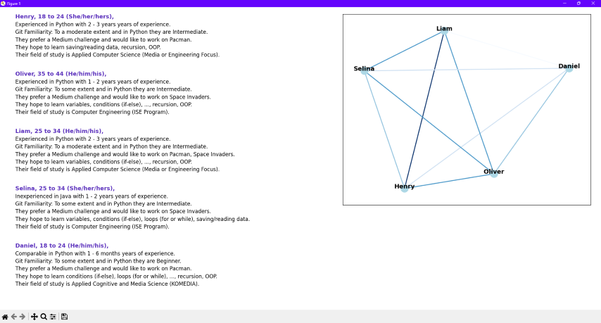

# **Hackathon Group Former**

Hackathon Group Former is a Python-based application designed to help form teams for hackathon like events based on various attributes such as programming skills, motivations, project preferences, familiarity, and demographic/background.

The application uses a graphical user interface (GUI) built with Tkinter and provides functionalities for loading survey data from the results of the pre-event-questionnaire, adjusting weights for different attributes, and generating teams based on the configured settings.

## Table of Contents

- [Visuals](#visuals)
- [Features](#features)
- [Dependencies](#libraries-and-dependencies)
- [Installation](#installation)
- [Usage](#usage)
- [Folder Structure](#folder-structure)
- [Files](#files)

## Visuals

1. After selecting a csv file with the survey results the main window opens.
    

2. When the teams are formed to your liking the visualization is ready to be openend from the main window.
    

3.
    

## Features

- Load survey data from a CSV file.
- Adjust weights for different attributes to influence team formation.
- Toggle attributes between homogenous and heterogenous within teams.
- Emphasize specific attributes to give them more importance in team formation.
- Generate teams based on the configured settings.
- Visualize the generated teams and their attributes.
- Save and load custom weights for attributes, if a necessary file is not in the storage it will be created.

## Libraries and Dependencies

- [Python 3](https://www.python.org/) Version: 3.13
- [sys](https://docs.python.org/3/library/sys.html)
- [os](https://docs.python.org/3/library/os.html)
- [re](https://docs.python.org/3/library/re.html)
- [json](https://docs.python.org/3/library/json.html)
- [itertools](https://docs.python.org/3/library/itertools.html)
- [Tkinter](https://docs.python.org/3/library/tkinter.html)
- [NetworkX](https://networkx.org/) Version: 3.3
- [Matplotlib](https://matplotlib.org/) Version: 3.8.4
- [pandas](https://pandas.pydata.org/) Version: 2.2.2

## Installation

### Using Github

1. **Clone the Repository**: Open your terminal and clone the repository using https and git with the following command in the directory u want:

    ```bash

    git clone https://github.com/Timotheus21/group_former.git

    ```

2. **Navigate to the Project Directory**: For example change your current directory inside your terminal to the cloned repository. Change the example path with your actually path.

    ```bash

    cd C:\example\path\group_former

    ```

3. **Create a Virtual Environment** (optional but recommended): Create and activate a virtual environment to manage dependencies:

    ```bash
    python -m venv env  # On Mac simply use python3 instead
    env\Scripts\activate  # On Mac use `source env/bin/activate`
    ```

4. **Install Dependencies**: Install the required dependencies using pip:

    ```bash

    python -m pip install -r requirements.txt

    ```

5. **Run the Application**: Run the application for example via the `main.py` file if your in the project directory.

    ```bash

    python main.py

    ```

### Using Docker

## Usage

1. When you run the application, a file dialog will prompt you to select a CSV file containing the survey data.
2. The main window will display various attributes and their weights. You can adjust the weights using the "+" and "-" buttons.
3. Toggle attributes between homogenous and heterogenous using the "Matched" and "Diverse" buttons.
4. Emphasize specific attributes using the "Emphasize" button.
5. Adjust the desired team size, maximum team size, and minimum team size.
6. Click "Generate Teams" to form teams based on the current configuration. If the teamsizes are invalid they will get adjusted.
7. Visualize the generated teams by clicking the appearing "Visualize Team" buttons.
8. Save the current weights to a file or load custom/standard weights using the respective buttons.
9. Load in a different survey file with the corresponding button if needed.
10. View the current configuration by clicking the "Show Current Configuration" button.

## Folder structure

```filenames

hackathon-group-former/
├── screen_shots/
│   ├── config.png
│   ├── mainwindow.png
│   └── visualize.png
├── storage/
│   ├── custom_weights.csv
│   ├── interpreter.json
│   ├── questionnaire_example.csv
│   ├── std_weights.csv
│   └── transformed_results_survey.csv
├── __pycache__/
├── config.py
├── dataprocessor.py
├── gui.py
├── main.py
├── selector.py
├── teamforming.py
├── tooltip.py
├── visualization.py
├── .dockerignore
├── .gitattributes
├── .gitignore
├── compose.yaml
├── Dockerfile
├── README.md
└── requirements.txt

```

## Files

| File             | Description                                                                                     |
|------------------|-------------------------------------------------------------------------------------------------|
| **`config.py`**        | Contains the Config class, which is responsible for displaying the current configuration in a separate window.                                                             |
| **`dataprocessor.py`** | Contains the DataProcessor class, which handles loading and processing the survey data, managing weights and attributes lists, and applying the questionnaire interpreter. |
| **`gui.py`**           | Contains the GUI class, which builds the main graphical user interface for the application.                                                                                |
| **`main.py`**          | The entry point of the application. It initializes the necessary components and starts the Tkinter main loop.                                                              |
| **`teamforming.py`**   | Contains the TeamForming class, which is responsible for generating teams based on the configured settings and calculated scores.                                          |
| **`tooltip.py`**       | Contains the Tooltip class, which provides tooltip functionality for the GUI.                                                                                              |
| **`visualization.py`** | Contains the Visualization class, which handles visualizing the generated teams using Matplotlib and NetworkX.                                                             |
| **`selector.py`**      | Contains the select_file function, which creates the temporary file selection window.                                                                                      |
